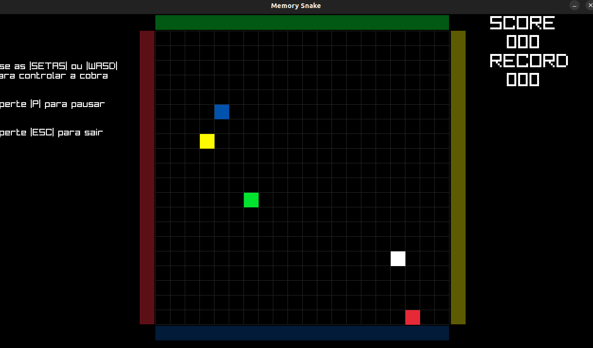

## Memory Snake

### Descrição

Uma mistura do jogo tradicional Snake com o jogo da memoria.

Desenvolvido em C com o uso da biblioteca de codigo aberto raylib (www.raylib.com).

--------------------------

This project has been created to be used with raylib (www.raylib.com) and it's licensed under an unmodified zlib/libpng license.

_Copyright (c) 2014-2023 Ramon Santamaria ([@raysan5](https://twitter.com/raysan5))_
